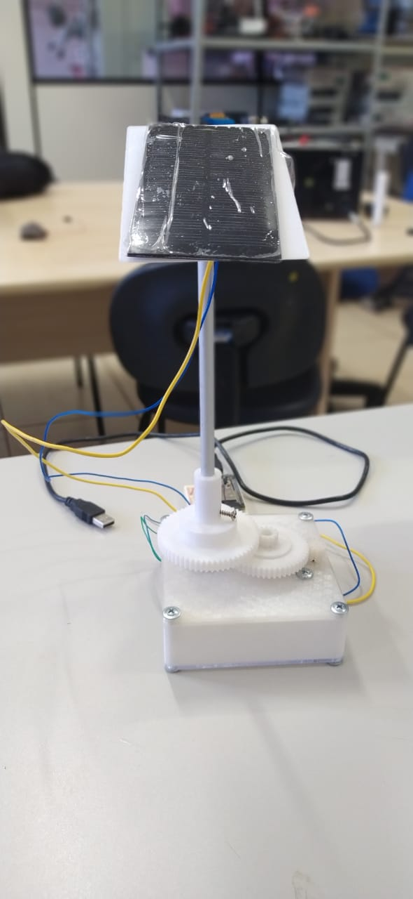

# Follow The Sun
### Hi 👋
Esse repositório é o resultado de um desafio na matéria de Programação Orientada a Eventos

Em que tive que desenvolver um programa supervisório em java para monitorar e controlar um sistema microcontrolado via a porta Usb. O equipamento desenvolvido no projeto, que busca otimizar a geração de energia fotovoltaica direcionando os painéis para a fonte de luz, de onde vem o nome do projeto follow the sun.

###Obs.
Os painéis não seguem diretamente o sol, devido algumas limitações construtivas, eles realizam uma varredura e depois se posicionam no melhor ponto encontrado

